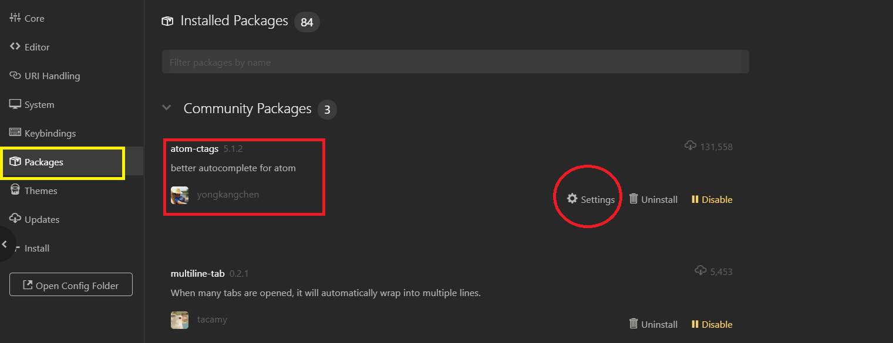
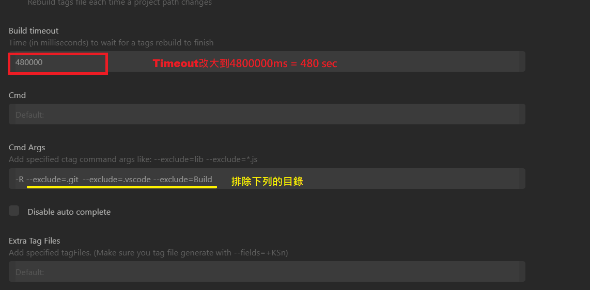
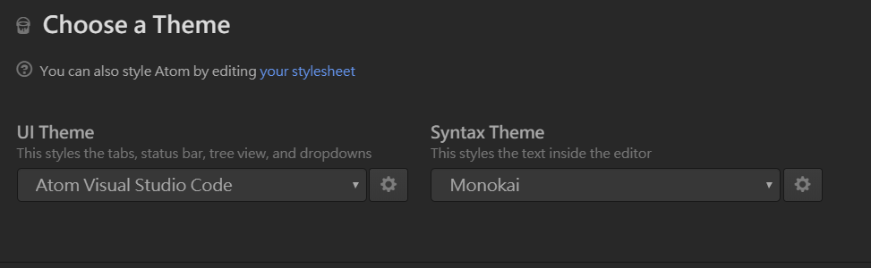
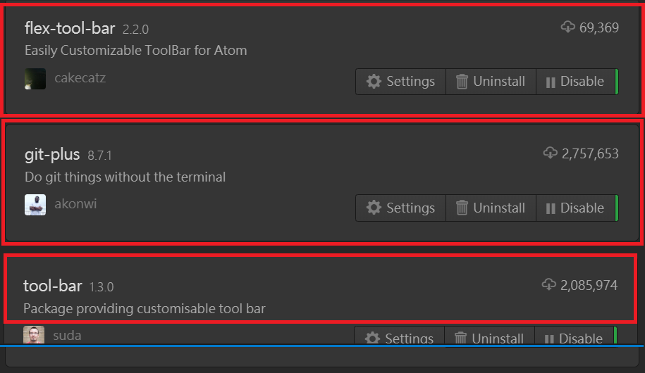
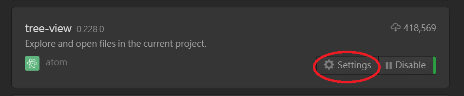
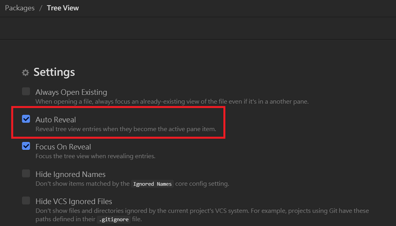
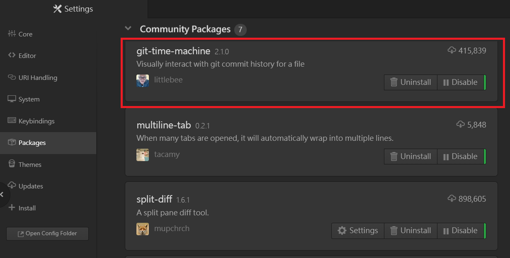
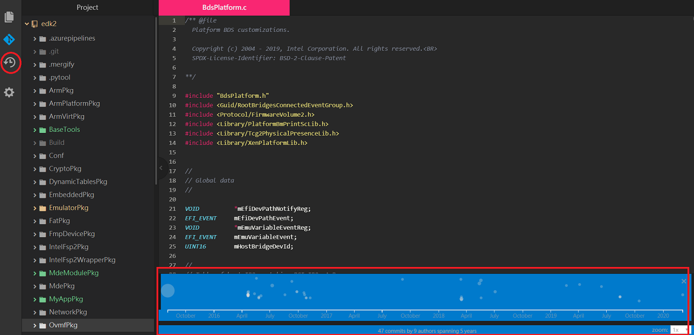
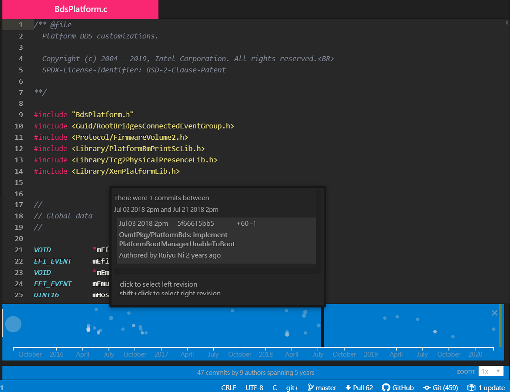
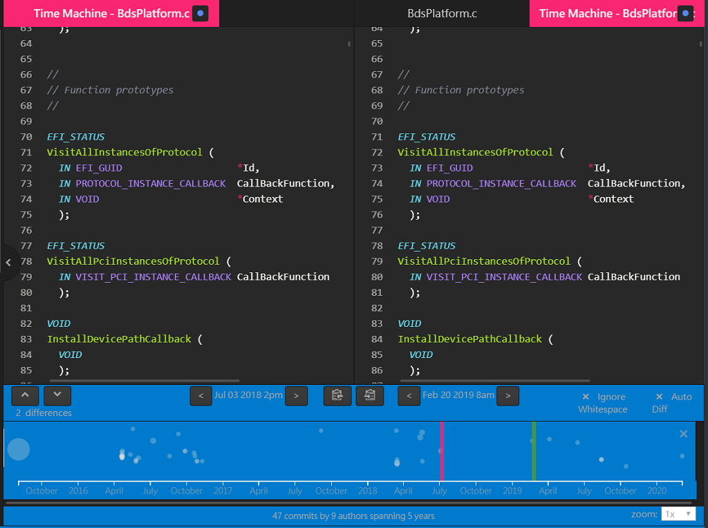

## Search Result的文字上加外框

如果你想在Search Result的文字上加外框 你可以開啟 C:\Users\\**your user name**\\.atom\\**styles.less**在檔案後面加

```
.editor .current-result .region {
  border-color: yellow;
  border-radius: 3px;
  border-width: 1px;
  border-style: solid;
  // background-color: rgba(255, 128, 0, 0.3);
}

.editor .find-result .region {
  border-color: yellow;
  border-radius: 3px;
  border-width: 1px;
  border-style: solid;
  // background-color: rgba(155, 149, 0, 0.1);
}
```

**border-color**    是邊框顏色

**border-radius**  是邊框圓角角度

**border-width**   是邊框線框

**border-style**    是邊框Style

------

## 如何把Ctage Timeout延長





------

## Atom 改成 VS code look and feel

- Step 1 . 先安裝Theme "Atom-Visual-Studio-Code" & "Monokai"



- Step 2. 裝下面列的package



- Step 3. 將下面copy到style.less, 如果還是習慣原來的one dark UI, 可以將**.theme-monokai**的"**monokai**"改成"**one-dark-ui**", 然後將 .bracket-matcher的backgound-color改成green會比較清楚

```
.theme-monokai {
  // Customize font color & style for comment
  .syntax--comment {
    color: hsl(220, 10%, 55%);; // hsl(hue, saturation, lightness)
    font-style: italic;
  }

  //Customize font size for Project Windows
  .tree-view {
    font-size: 120%;
  }

  //Customize font color for Project Windows
  li.file.entry.list-item, .list-tree {
    color: #d0d0d0;
  }

  //Customize font size & color for Project Windows title & Filename tab title
  .tab-bar .tab {
    font-size: 120%;
    color: #d0d0d0;
  }

  //Customize font color & background for active editor tab title
  .texteditor.tab.sortable.active::before, .texteditor.tab.sortable.active, .texteditor.tab.sortable.active::after {
    //background-image: -webkit-linear-gradient(top, #35404a, #4A7FB2);
    background-image: -webkit-linear-gradient(top, #f92672, #f92672);
    color: #eeeeee;
    font-weight: bold;
  }

  //Adjust tab close icon location
  .tab-bar .tab .close-icon
  {
    // padding: 0em;
    margin-right: 0.5em;
    // margin-top: 10px;
    // line-height: 12px;
    // height: 12px;
  }

  //Customize style/color for find + replace
  .find-result .region.region.region,
  .current-result .region.region.region {
    border-radius: 2px;
    background-color: @syntax-result-marker-color;
    transition: border-color .4s;
  }
  .find-result .region.region.region {
    border: 2px solid transparent;
  }
  .current-result .region.region.region {
    border: 2px solid @syntax-result-marker-color-selected;
    transition-duration: .1s;
    border-color: yellow;
  }

  //Customize fontsize for Project Find Results
  .preview-pane {
    font-size: 125%;
  }

  //Customize color/style of bracket-matcher
  .bracket-matcher .region {
      border-bottom: 1px solid #de9536;
      background-color: #ffd900;
      opacity: 0.7;
  }

  //Customize log font color/size for git-plus package
  .git-plus-log {
    #git-plus-commits {
      color : #d0d0d0;
      font-size: 120%;
    }
  }
}

```

4. 將下面內容copy到toolbar.cson

   ```
   [
     {
       type: "button"
       iconset: "ion"
       icon: "ios-copy"
       callback: "tree-view:toggle"
       tooltip: "Toggle Project Tree"
     }
     {
       type: "button"
       iconset: "devicon"
       icon: "git-plain"
       callback: "git-plus:menu"
       tooltip: "Git"
       style:
         color: "#0198E1"
     }
     {
       type: "spacer"
     }
     {
       type: "button"
       icon: "gear"
       callback: "settings-view:open"
       tooltip: "Settings"
     }
   ]
   ```

------

## Auto Reveal in Tree-View

請把tree-view package的**Auto Reveal**給開啟, 這樣當你開檔案時, 左邊的project window會自動捲到該目錄下





------

## File list字形加大

如果想把file list的字形加大, 把下面這個加在Style.less

```
//Customize font color/size for list group
.select-list ol.list-group,
  &.select-list ol.list-group {
    fornt-size: 110%;
  }
}
```

------

## Git Time Machine
這是你的工作目錄是checkout出來有.git目錄時可以用的

首先先安裝git-time-machine package



再來如果你有安裝toolbar的套件, 你可以降下面的設定copy到C:\Users\\**your user name**\\.atom\\**toolbar.cson**裡面
 ```
  {
    type: "button"
    iconset: "icomoon"
    icon: "history"
    callback: "git-time-machine:toggle"
    tooltip: "git time machine"
  }
 ```
此時左邊的toolbar就會有以一個新的icon, 你可以點選這個icon, 或者直接按"A+T" hotkey啟動git-time-machine



再來移動下面時間軸點選一個commit, 此時會切割兩的視窗呈現file diff, 然後下面時間軸左邊紅色條是你選取的commit, 右邊的綠色條就是你的最新的commit




再來你可以試著移動綠色條, 按下Shift+Click來點選你想要比較的commit

